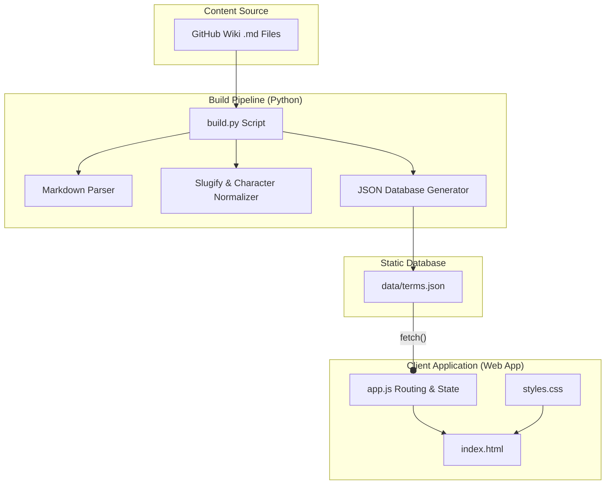

# AI Agent Guidelines & Instructions

Welcome to the **Project Management Wiki** developer and agent documentation. This file provides critical instructions, technical specifications, and standards for AI Agents contributing to or modifying this codebase.

---

## 🛠️ Tech Stack & Constraints

Before making any code changes, agents must respect the following constraints:
1. **Core Technology**:
   - The application is a frameworkless, Single Page Application (SPA).
   - Use **Vanilla HTML5**, **Vanilla CSS3**, and **modern Vanilla JavaScript (ES6+)**.
   - Do **NOT** install or use external JS frameworks (e.g., React, Vue, Svelte) or CSS frameworks (e.g., Tailwind, Bootstrap) unless explicitly requested by the user.
2. **Performance Budget**:
   - The total client-side JavaScript size must be kept under **10KB**.
   - Minimizing DOM layout shifts, avoiding bloated bundles, and keeping page load times sub-millisecond are key goals.
3. **Responsive Design**:
   - Desktop and mobile layouts are controlled by media queries toggled on `body[data-view]`. Do not use framework helpers or complex layout managers that run on JS.

---

## 📐 Architecture & Data Flow

This application is built as a static site that serves terms compiled into a single JSON database file.



### 1. The Compilation Script (`build.py`)
- Reads raw Markdown files from `../project-management-wiki.wiki/`.
- Excludes files starting with an underscore (e.g., `_Sidebar.md`, `_Footer.md`) and non-content documentation files (e.g., `AGENTS.md`).
- Character normalizations: Polish characters are translated to English equivalents (e.g. `ą` -> `a`, `ł` -> `l`) for slug generation.
- Formats links to use hash routing (e.g., `[ADKAR](ADKAR)` is rewritten to `[ADKAR](#/term/adkar)`).
- Produces the static database: `data/terms.json`.

### 2. Client Routing & State (`app.js`)
- Feeds data asynchronously using `fetch("data/terms.json")`.
- Manages routing using the `hashchange` event (e.g., `#/term/<slug>`).
- Performs instant search on keypress matching titles, categories, descriptions, and related links.
- Intercepts keypress events (e.g., pressing `/` focuses the search bar).
- Dynamically updates the page's SEO attributes (document title, meta description, and Open Graph/Twitter meta tags) based on the currently displayed term.

---

## ✍️ Content & Terminology Standards (Critical)

When writing, reviewing, or generating Polish wiki content:
1. **The Term "AI Agents"**: Always translate "AI Agents" as **Agenty AI** (using the neuter plural form, e.g., *"wielozadaniowe agenty"*, **NOT** *"agenci"*). This is a strict project-wide standard.
2. **Contributing Structure**:
   Every content page must follow the structure defined in [Contributing.md](../project-management-wiki.wiki/Contributing.md). It must include:
   - `# [Term Title]`
   - `## Definicja`
   - `**Kategoria:** [[Category Link](Category-Slug)]`
   - `## Po co to istnieje`
   - `## Jak to działa w praktyce`
   - `## Przykład z projektu`
   - `## Gdzie to się pojawia`
   - `## Powiązania`
   - `## Typowe błędy / nieporozumienia`

---

## 🧪 Verification Protocol for Agents

Whenever making changes to `build.py` or the wiki content:
1. **Run build script**:
   ```bash
   python3 build.py
   ```
2. **Verify terms database**:
   Inspect `data/terms.json` to ensure the file is generated, valid JSON, and that the changes compile properly.
3. **Verify locally**:
   Serve the project locally using Python's built-in HTTP server:
   ```bash
   python3 -m http.server 8000
   ```
   Open `http://localhost:8000` to verify that routing, styling, search, and KaTeX math rendering are fully operational.
