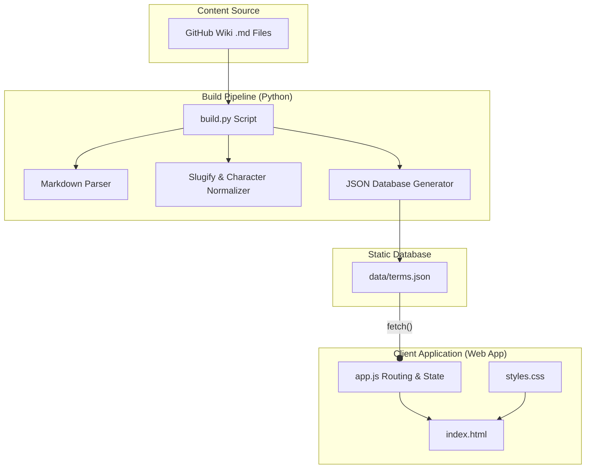

# Project Management - Ściąga (Wiki)

[](https://unamatasanatarai.github.io/project-management-wiki/)
[](https://github.com/unamatasanatarai/project-management-wiki/wiki)

> 🚀 **[Przejdź do interaktywnej aplikacji (GitHub Pages)](https://unamatasanatarai.github.io/project-management-wiki/)**  
> 📖 **[Przejdź do źródłowej dokumentacji Wiki (GitHub Wiki)](https://github.com/unamatasanatarai/project-management-wiki/wiki)**

---

An interactive, high-performance web-based encyclopedia and search engine for Project Management terminology. Built as a modernized, mobile-first Single Page Application (SPA), it serves compiled wiki pages instantly from static files.

---

## 💡 Why This Project Exists

Traditional wikis can be slow and hard to navigate on mobile devices. This project decouples content management (using GitHub Wiki markdown files) from the user experience by introducing a compile-to-JSON pipeline and a client-side SPA. 

It provides project managers, engineers, and product owners with lightning-fast access to critical definitions (e.g., ADKAR, KPI, ROI, AIDA) directly on their mobile phones or desktop browsers without loading overhead.

---

## 🛠️ Key Capabilities

- **Compile-to-Static Pipeline**: An offline Python generator parses raw Wiki markdown files, cleans Polish characters for URL-friendly slug generation, extracts metadata (titles, categories, relationships), compiles Markdown to clean HTML snippets, and exports them into a high-performance database file (`data/terms.json`).
- **Instant Search engine**: Search bar in a sticky header filters terms matching titles, categories, summaries, and related keywords instantly on keypress.
- **Responsive Split-Pane Interface**:
  - **Desktop ($\ge$ 768px)**: A two-column interface showing the scrollable, query-filtered term list side-by-side with the selected term details.
  - **Mobile (< 768px)**: Stacked list and details screens with smooth navigation switches controlled entirely via responsive CSS variables.
- **Dynamic SEO & Open Graph Updates**: Automatic runtime updates of the document title, description, URL, and Open Graph/Twitter Cards meta attributes whenever the active route changes.
- **Advanced UX Shortcuts**: Pressing the `/` key anywhere on the page instantly focuses the search bar with auto-selected text. A customized clear ("X") button hides natively to keep layout presentation uniform.

---

## 📐 Architecture Overview



### Technical Design Decisions & Trade-offs

1. **Static JSON Database**: Serving content from a single consolidated JSON file is faster and cheaper than queryable backend databases. This eliminates server maintenance costs and simplifies deployment to GitHub Pages.
2. **Frameworkless Architecture**: Using Vanilla JavaScript (ES6) instead of heavy frameworks (like React or Vue) keeps the package size extremely lightweight (under 10KB total script size) and ensures sub-millisecond initial load times.
3. **Pure CSS Responsive Views**: Media queries evaluate state flags on `body[data-view]` to show or hide the sidebar/content pages on mobile, preventing DOM layout-shifts and layout-rendering glitches.

---

## 💻 Tech Stack

### Languages
- Python (Build Pipeline)
- Modern Vanilla JavaScript (ES6+, client side logic)
- HTML5 & CSS3

### Dependencies (Build Pipeline Only)
- `markdown`: Python parser converting MD to HTML snippets.
- `tables`, `fenced_code`, `sane_lists`: Markdown extensions to support rich tables and documentation layouts.

---

## 🚀 Development & Compilation

To build the database and host the wiki locally:

### 1. Compile Terms
Ensure your markdown source files are in `../project-management-wiki.wiki`, then run the build pipeline:
```bash
# Setup virtual environment
python3 -m venv venv
source venv/bin/activate
pip install -r requirements.txt

# Run compilation
python3 build.py
```

### 2. Start Local Server
Because the app fetches the compiled `data/terms.json` asynchronously, serve the directory locally to bypass CORS constraints:
```bash
python3 -m http.server 8000
```
Open `http://localhost:8000` in your web browser.

---

## 📈 Future Roadmap
- **Client-Side Caching**: Implement a Service Worker to cache loaded assets for full offline utilization.
- **Interactive Relationship Graph**: Visualize term connections dynamically using a canvas-based layout.
- **Search Term Highlighting**: Dynamically mark found words within the content bodies using HTML `<mark>`.
